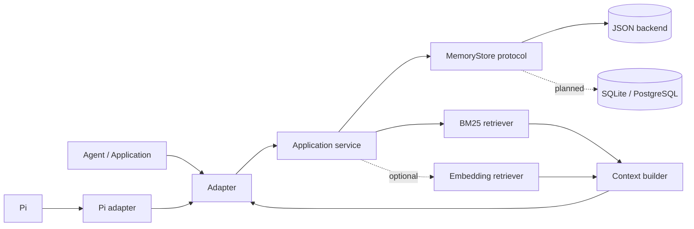

# Agent Memory Engine

Framework-agnostic persistent and retrieval-augmented memory infrastructure for
AI agents.

[](https://github.com/how1215/agent-memory-engine/actions/workflows/ci.yml)
[](https://www.python.org/)

Agent Memory Engine provides a small, inspectable long-term memory outside an
agent's conversation window. The current release captures durable facts, stores
them locally, retrieves relevant observations with BM25 or optional multilingual
hybrid search, and builds token-budgeted context. Pi is the first adapter, not a
dependency of the engine.

> **Project status:** local-first reference implementation. The original JSON
> API remains available. An opt-in managed path now provides review, scoped
> retrieval, encrypted SQLite storage, and a local bridge. The separate
> [Personal Agent app](https://github.com/how1215/personal-agent) implements
> macOS integration and encrypted backups; broader engine production controls
> remain future work.

## Why this project matters

Conversation history, compaction, and persistent memory solve different
lifecycle problems. A mature memory system must decide what to retain, isolate
memories by tenant and workspace, retrieve useful evidence, resolve stale or
conflicting facts, and fit selected evidence into an agent's context budget.
This project makes those stages explicit and independently replaceable.

### Implemented today

- Persistent, human-readable JSON storage with SHA-256 deduplication and atomic writes
- A `MemoryStore` protocol and dependency-injection seam for future backends
- Deterministic BM25 ranking with lightweight English, numeric, and CJK tokenization
- Optional hybrid ranking with local multilingual sentence embeddings
- Token-budgeted context construction
- Framework-neutral Python API and `agent-memory` CLI
- Opt-in Pi adapter with graceful subprocess failure handling
- Repeatable evaluation over 130 memories and 61 labeled queries
- Automated tests across Python 3.10–3.13 in GitHub Actions
- Opt-in managed memory with candidate review, revision/deletion, encrypted
  SQLite storage, legacy import, and a versioned JSON-lines bridge

### Planned platform capabilities

- Additional memory kinds beyond the managed preference and decision records
- PostgreSQL and vector-index backends
- Multi-user tenant isolation, retention, backup/export, and key management
- Recency, confidence, provenance, conflict, and supersession policies
- Async service API, observability, adapter SDK, and additional agent adapters

See the [roadmap](docs/roadmap.md) and [architecture guide](docs/architecture.md).

The [managed memory v1 API](docs/managed-memory.md) adds review, scoped
retrieval, encrypted SQLite storage, legacy import, and a JSON-lines app bridge.
It is optional and leaves the original JSON CLI behavior intact.

## Measured retrieval quality

These are reproducible offline fixture results, not production traffic or
end-to-end answer-quality claims.

| Dataset | Retriever | Recall@5 | MRR | nDCG@5 |
| --- | --- | ---: | ---: | ---: |
| 30 memories / 21 queries | BM25 | 0.810 | 0.810 | 0.802 |
| 30 memories / 21 queries | Hybrid, α=0.3 | **1.000** | **0.914** | **0.936** |
| 100 memories / 40 queries | BM25 | 0.838 | 0.826 | 0.795 |
| 100 memories / 40 queries | Hybrid, α=0.3 | **0.938** | **0.943** | **0.910** |

See the [engineering case study](docs/engineering-case-study.md) for methodology
and limitations.

## Architecture



Dependency direction is inward: adapters depend on the engine; the engine does
not import Pi. `MemoryStore` is a structural protocol, so new persistence
backends can be injected with `set_store()` without changing capture or
retrieval callers.

## Quick start

```bash
git clone https://github.com/how1215/agent-memory-engine.git
cd agent-memory-engine
python -m venv .venv
source .venv/bin/activate
python -m pip install -e ".[test]"
pytest
```

Use the framework-neutral CLI:

```bash
export AGENT_MEMORY_PATH="$PWD/.agent-memory.json"

agent-memory capture \
  --summary "Use pnpm for this repository" \
  --tags "tooling,package-manager"

agent-memory retrieve --query "Which package manager should I use?" --k 3
agent-memory inject --query "How should I install dependencies?" --budget 500
```

Without installation:

```bash
python -m agent_memory_engine.cli retrieve --query "package manager" --k 3
```

The old `pi-memory` command and `PI_MEMORY_*` environment variables remain
transitional aliases, but new integrations should use `agent-memory` and
`AGENT_MEMORY_*`.

## Retrieval modes

### Deterministic BM25

BM25 is the default because it is fast, transparent, reproducible, and has no
model dependency. It works well for commands, paths, identifiers, and library
names.

### Hybrid semantic search

```bash
python -m pip install -e ".[hybrid,test]"
AGENT_MEMORY_HYBRID=1 agent-memory retrieve \
  --query "Which package manager should I use?" --k 3
```

```text
score = α × normalized_bm25 + (1 − α) × cosine_similarity
```

The default `α=0.3` came from a small fixture sweep. Override it with
`AGENT_MEMORY_HYBRID_ALPHA`. The default embedding model is
`sentence-transformers/paraphrase-multilingual-MiniLM-L12-v2`; override it with
`AGENT_MEMORY_EMBED_MODEL`.

## Pi adapter

Pi is maintained as the first integration under `adapters/pi/`:

```bash
npm install -g --ignore-scripts @earendil-works/pi-coding-agent
pi -e "$PWD/adapters/pi/extension.ts"
```

The agent can call `remember` to capture durable facts. Retrieval is opt-in per
request to avoid unnecessary subprocess and context costs:

```text
@memory How should I install dependencies?
```

The adapter removes `@memory`, invokes the engine, and injects a bounded
`[Relevant memories from previous sessions]` block. Unmarked prompts do not
start retrieval; previously injected context remains in the Pi session.

## Python integration

```python
from agent_memory_engine import capture, make_observation, retrieve
from agent_memory_engine.storage.base import MemoryStore

capture(make_observation("Use pnpm for this repository", tags=["tooling"]))
hits = retrieve("package manager", k=3)
```

A custom backend can implement `MemoryStore` and be installed with
`set_store(custom_store)`. The current service still selects retrieval through
environment configuration; a first-class engine/configuration object is planned
before multiple backends and policies are added.

## Benchmarking

```bash
python benchmark/run_benchmark.py --k 5 --per-query
python benchmark/run_benchmark.py \
  --corpus corpus_large.jsonl \
  --queries queries_large.jsonl \
  --k 5
AGENT_MEMORY_HYBRID=1 python benchmark/run_benchmark.py --k 5
python benchmark/run_benchmark.py --json
```

The runner uses an isolated temporary store and reports Recall@k, MRR, and
nDCG@k. See [`benchmark/README.md`](benchmark/README.md).

## Configuration

| Environment variable | Default | Purpose |
| --- | --- | --- |
| `AGENT_MEMORY_PATH` | `~/.agent-memory.json` | Local JSON backend path |
| `AGENT_MEMORY_HYBRID` | unset | Set to `1` for hybrid retrieval |
| `AGENT_MEMORY_HYBRID_ALPHA` | `0.3` | BM25 weight in hybrid scoring |
| `AGENT_MEMORY_EMBED_MODEL` | multilingual MiniLM | Sentence-transformers model ID |
| `AGENT_MEMORY_PYTHON` | `PYTHON` or `python3` | Interpreter used by the Pi adapter |

`PI_MEMORY_PATH`, `PI_MEMORY_HYBRID`, `PI_MEMORY_HYBRID_ALPHA`, and
`PI_MEMORY_EMBED_MODEL` are accepted as deprecated compatibility aliases.

## Repository map

```text
agent_memory_engine/             framework-neutral Python engine
├── config.py                    configuration and compatibility aliases
├── service.py                   capture, retrieval, and context orchestration
├── cli.py                       framework-neutral CLI
├── retrieval/
│   ├── bm25.py                  deterministic lexical retrieval
│   └── hybrid.py                optional semantic + lexical retrieval
└── storage/
    ├── base.py                  MemoryStore protocol
    └── json_store.py            atomic local JSON backend
adapters/
└── pi/extension.ts              Pi lifecycle/tool adapter
benchmark/                       labeled datasets and evaluation runner
tests/                           unit and integration tests
demo/                            end-to-end Pi demonstration
docs/
├── architecture.md              boundaries and extension contracts
├── roadmap.md                   maturity plan and acceptance criteria
├── engineering-case-study.md    rationale, measurements, and trade-offs
└── interview_guide.md           portfolio and interview guide
```

## Current boundaries

The current release is not a hosted multi-user memory platform. It has one
process-local service instance, a single JSON backend, approximate token
counting, no automatic retention, no memory conflict resolution, and no
sensitive-data classification. These constraints are intentional and documented
so future features can be evaluated rather than implied.

## Contributing

Read [`CONTRIBUTING.md`](CONTRIBUTING.md) before adding a backend, retriever,
policy, or adapter. Every feature should include tests, benchmark impact where
applicable, migration notes, and an explicit failure/fallback strategy.
