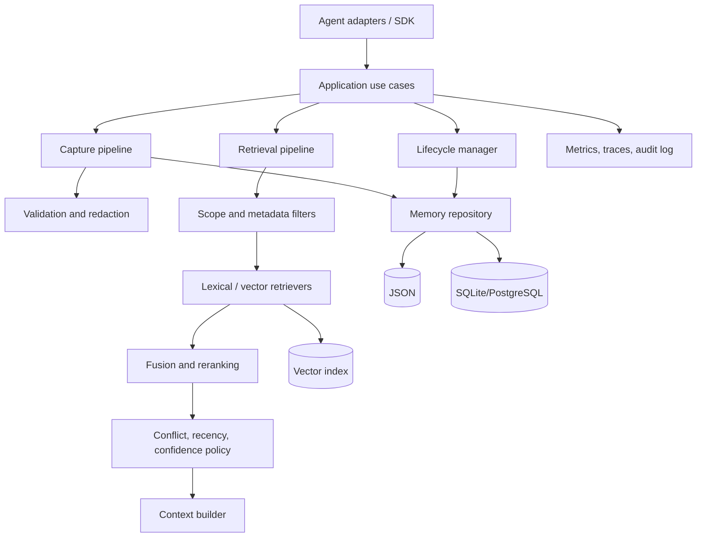

# Agent Memory Engine architecture

## Architectural goal

Agent Memory Engine is evolving from a Pi-specific prototype into a
framework-neutral memory runtime. The core must remain usable without an agent
SDK, model provider, vector database, or resident service. Integrations belong
at the boundary and depend on stable engine contracts.

## Design principles

1. **Framework-neutral core:** no Pi, LangChain, or provider imports in the engine.
2. **Explicit lifecycle:** capture, validate, persist, retrieve, rank, select,
   render, expire, and delete are separate concerns.
3. **Replaceable infrastructure:** storage, retrieval, embedding, tokenization,
   and policies use narrow contracts.
4. **Evidence over hidden state:** retrieved memories retain provenance and can
   eventually be cited or inspected.
5. **Safe degradation:** optional semantic or remote components fall back to a
   deterministic local path.
6. **Measurable changes:** ranking and policy changes are benchmarked against
   held-out data and latency budgets.
7. **Secure isolation:** tenant/workspace scope is part of the data model, not an
   adapter-side filter added after retrieval.

## Current dependency map

```text
adapters/pi
    └── agent_memory_engine.cli
            └── agent_memory_engine.service
                    ├── storage.base.MemoryStore
                    ├── storage.json_store.JsonStore
                    ├── retrieval.bm25
                    └── retrieval.hybrid (optional)
```

The current CLI subprocess is an integration transport, not the domain API.
Python integrations should call the package API directly. Future remote adapters
will use a versioned service/API transport.

## Current contracts

### MemoryStore

`agent_memory_engine.storage.base.MemoryStore` defines the minimum backend
surface:

```python
class MemoryStore(Protocol):
    def add(self, observation: dict) -> bool: ...
    def all(self) -> list[dict]: ...
    def clear(self) -> None: ...
```

This intentionally mirrors current behavior. Before adding SQLite, the contract
should evolve to typed records, scoped queries, deletion, pagination,
transactions, and capability discovery. Do not force vector operations into the
storage contract; retrieval indexes may be separate components.

### Application service

`service.py` owns the current use cases: capture, retrieve, and build injection.
`set_store()` permits backend injection. Global configuration is retained for
CLI compatibility, but the target design is an instantiable `MemoryEngine`
object so tests and multiple tenants do not share process-global state.

### Adapter contract

An adapter should only:

- translate framework events and tool calls into engine operations;
- pass explicit tenant, workspace, session, and source identity;
- apply timeout/cancellation and bounded output rules;
- map failures to non-blocking agent behavior;
- avoid embedding framework-specific fields into the core schema.

## Target architecture



## Target domain model

A versioned memory record should eventually include:

- `id`, `schema_version`, and immutable creation timestamp;
- `tenant_id`, `workspace_id`, `session_id`, and source identity;
- normalized content plus optional raw/source reference;
- memory kind: episodic, semantic, procedural, preference, or decision;
- tags, provenance, confidence, sensitivity, and retention policy;
- revision, supersedes/superseded-by links, expiration, and tombstone state;
- access statistics maintained separately from semantic content.

The present observation dictionary is schema version zero. Migration code must
preserve existing JSON records and never silently discard unknown fields.

## Extension rules

### Adding a storage backend

1. Implement the `MemoryStore` behavior currently required by the service.
2. Add backend contract tests shared with `JsonStore`.
3. Document consistency, concurrency, and transaction guarantees.
4. Define migration, backup, and failure recovery.
5. Do not select a backend by importing it from an adapter.

### Adding a retriever

1. Preserve stable IDs and return scores plus retriever metadata internally.
2. Define behavior for empty queries and no-match results.
3. Add fixture and held-out benchmark results.
4. Record model/version/configuration for reproducibility.
5. Provide timeout and deterministic fallback behavior.

### Adding an adapter

1. Place it under `adapters/<framework>/`.
2. Keep capture and retrieval opt-in behavior explicit.
3. Bound process/network time and output size.
4. Pass project/workspace identity when scoped storage exists.
5. Add an end-to-end smoke test and adapter-specific README.

## Security boundaries

Stored memory is untrusted data. Future context builders must delimit it as
evidence, prevent it from overriding higher-priority instructions, and retain
provenance. Secrets should be detected before persistence, access should be
scoped before retrieval, and deletion must propagate to derived indexes and
backups according to documented policy.

## Architecture decision sequence

Before adding a daemon or distributed service, measure subprocess latency.
Before adopting a vector database, measure corpus size and retrieval needs.
Before adding learned memory extraction, establish capture quality and safety
benchmarks. Complexity should be introduced only when a measured constraint
requires it.
